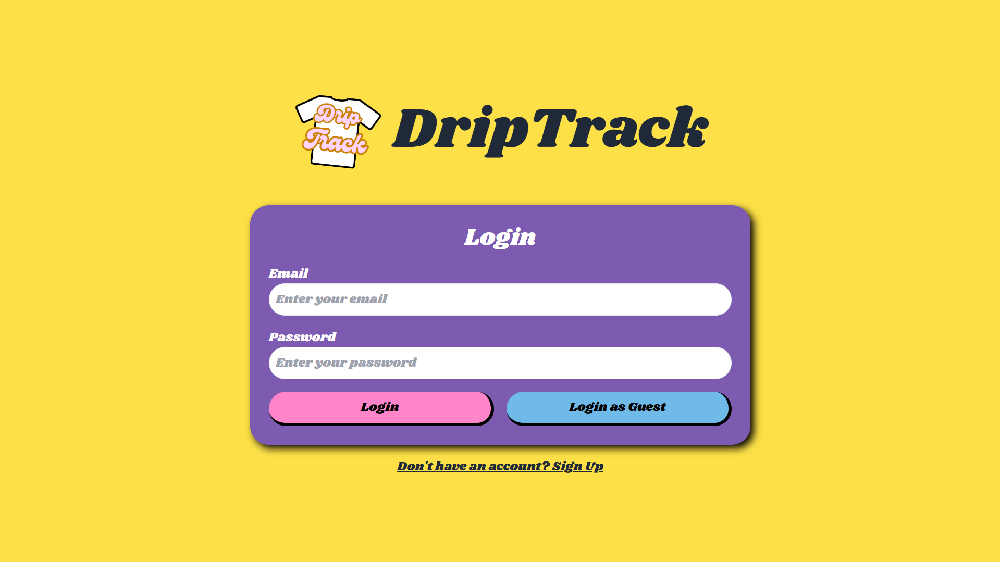
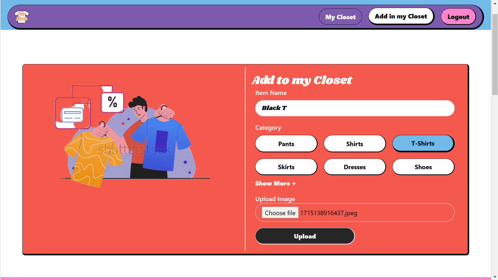
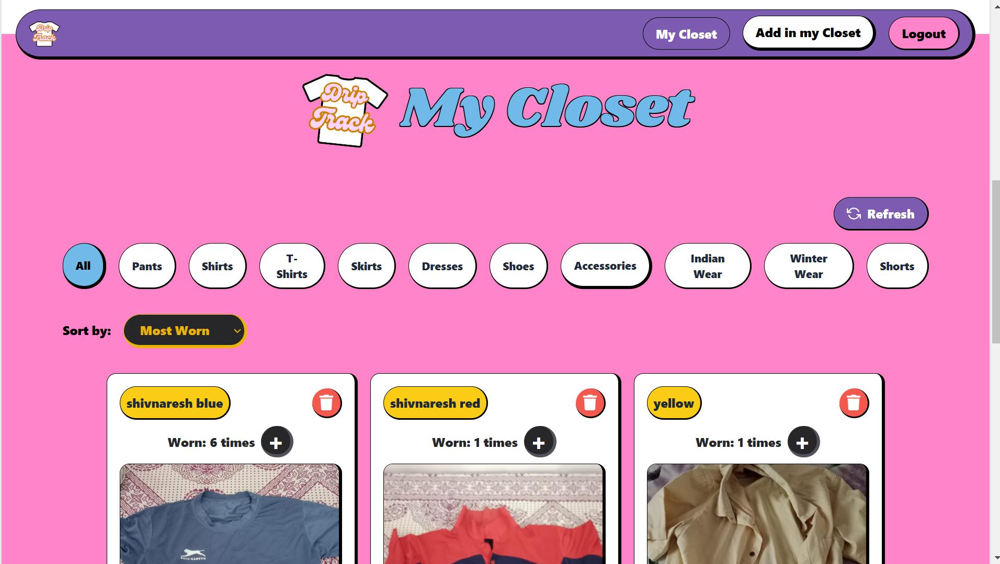
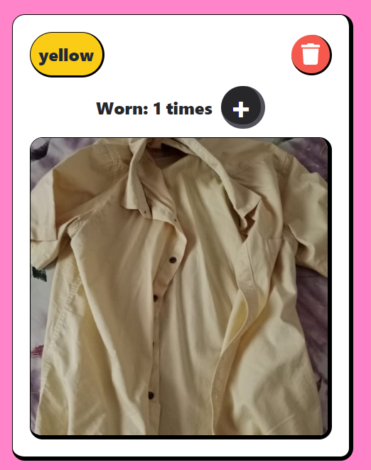
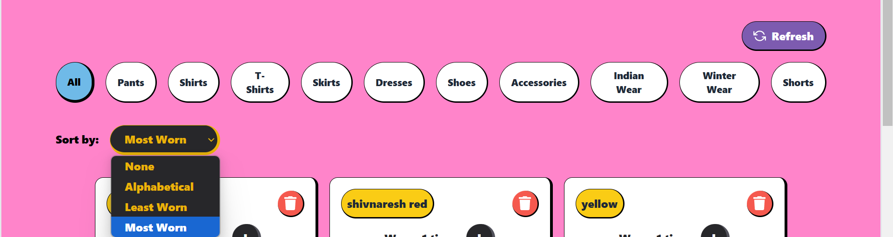

# DripTrack - Wardrobe Manager 
  

 <b>Click this icon to view Project<b>

Ever feel like you have nothing to wear, even though your wardrobe is packed? DripTrack is here to change that. It helps you keep track of what clothes you already have and how often you wear them—all from your phone. No more digging through piles or buying clothes you don’t need. Just scroll through your wardrobe, mix and match outfits, and you’ll always know what you’ve got. Plus, by reducing unnecessary purchases, we’re all about sustainability and keeping your wardrobe organized.

### Key Features :

#### 1. **User Login (Authentication)**    `Status:Completed` 
   - **Problem**: I need to make sure users can log in and their data is safe.
   - **Solution**: Implement a secure login system with **JWT tokens** to manage user sessions. This way, each user’s wardrobe data is separate.
   - **Next steps**: Set up signup/login forms and connect them to an authentication system in the backend.

     

#### 2. **Wardrobe Management (Adding Items)** `Status:Completed` 
   - **Problem**: Users need to upload their clothes and categorize them.
   - **Solution**: Provide a form where users can upload photos and manually assign categories like “shirts,” “pants,” and more.
   - **Next steps**: Build an upload form, connect it to a backend API that stores these images, and organize them into categories.

  

  

#### 3. **Usage Tracking** `Status:Completed` 
   - **Problem**: How do users keep track of how often they wear an item?
   - **Solution**: Create a button that allows users to mark when they wear an item, which increments a counter for that item’s usage.
   - **Next steps**: Implement the usage tracking button and make sure the count updates in the database every time an item is worn.

   

   

#### 4. **Sorting by Usage** `Status:Completed` 
   - **Problem**: How can users see which items they wear the most or least?
   - **Solution**: Add sorting functionality that allows users to sort their wardrobe items by usage (ascending/descending).
   - **Next steps**: Create a dropdown to select the sort option, and fetch the sorted data from the backend.

 
   

## Tech Stack

- **Frontend**: 
  - **React.js** 
  - **Vite** 
  - **Tailwind CSS** 

- **Backend**:
  - **Node.js** 
  - **Express.js** 
  - **MongoDB** 

## Challenges I Faced

1. **Managing Image Uploads**: Figuring out how to handle image uploads securely and efficiently.
2. **Real-Time Updates**: Keeping the wardrobe data up-to-date with real-time usage tracking.
3. **Mobile Responsiveness**: Ensuring the app looks good on all devices (mobile-first design with Tailwind).

### End Goal
To have a simple but effective wardrobe management app that helps people keep their clothes organized and track what they wear the most. Eventually, I might even add AI to recommend outfits based on what you wear most often.

Stay tuned! 🚀
