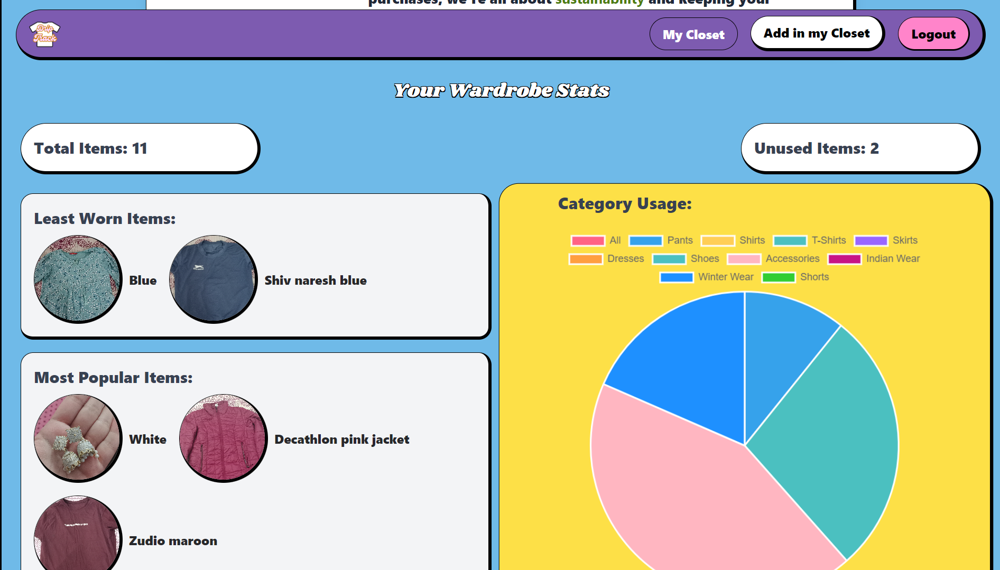
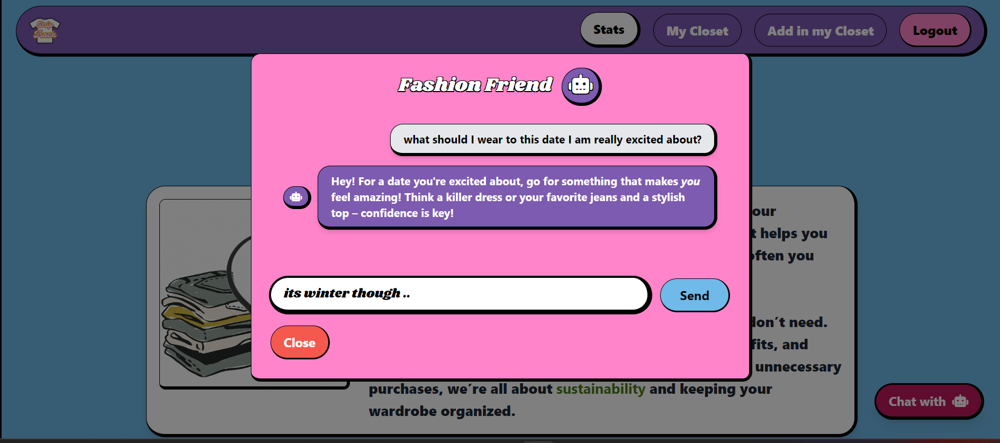
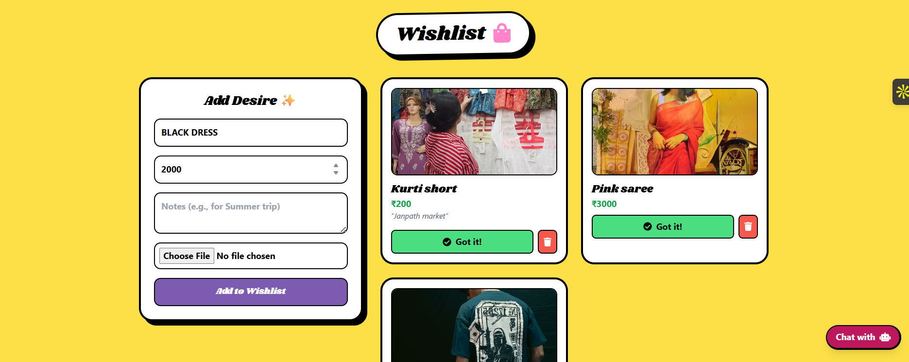
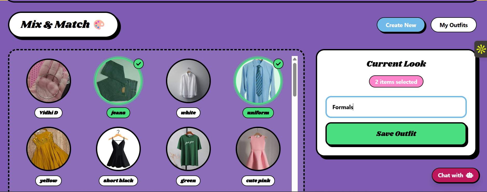

# DripTrack - Wardrobe Manager 
  
[](https://wakatime.com/badge/user/1fc26c7a-896d-4495-8fa5-a34266fbb649/project/78fed24f-dc0a-4851-b96e-e305a1408586)

<a href="https://drip-track.vercel.app/">  </a> <b>Click this icon to view Project<b>

Ever feel like you have nothing to wear, even though your wardrobe is packed? DripTrack is here to change that. It helps you keep track of what clothes you already have and how often you wear them—all from your phone. No more digging through piles or buying clothes you don’t need. Just scroll through your wardrobe, mix and match outfits, and you’ll always know what you’ve got. Plus, by reducing unnecessary purchases, we’re all about sustainability and keeping your wardrobe organized.

### Key Features:

#### 1. **User Login (Authentication)** `Status: Completed`
   - **Problem**: I need to make sure users can log in and their data is safe.
   - **Solution**: Implement a secure login system with **JWT tokens** to manage user sessions. This way, each user’s wardrobe data is separate.
   
   

#### 2.  **Stats - Track Your Wardrobe Usage** `Status: Complete`
   - **Problem**: Users need insights into their wardrobe usage, such as how many times they've worn certain items.
   - **Solution**: Add a Stats page that displays key wardrobe statistics like total items, most worn items, and usage frequency for each item.
   
   

#### 3. **Wardrobe Management (Adding Items)** `Status: Completed`
   - **Problem**: Users need to upload their clothes and categorize them.
   - **Solution**: Provide a form where users can upload photos and manually assign categories like “shirts,” “pants,” and more.

     

     

#### 4. **Usage Tracking** `Status: Completed`
   - **Problem**: How do users keep track of how often they wear an item?
   - **Solution**: Create a button that allows users to mark when they wear an item, which increments a counter for that item’s usage.

   

#### 5. **Sorting by Usage** `Status: Completed`
   - **Problem**: How can users see which items they wear the most or least?
   - **Solution**: Add sorting functionality that allows users to sort their wardrobe items by usage (ascending/descending).

   

#### 6. **Fashion AI Chatbot** `Status: Completed`
   - **Problem**: Users want personalized fashion advice and help with outfit choices.
   - **Solution**: Add an AI-powered chatbot to answer fashion-related questions. The chatbot will respond with helpful tips, such as suggesting outfits, answering questions about items in the wardrobe, and providing general fashion advice based on trends and user preferences.

        

#### 7. **Wishlist - Save for Later** `Status: Completed`
   - **Problem**: Users often find items they like but aren't ready to buy yet, leading to lost finds or impulse purchases.
   - **Solution**: A dedicated Wishlist section where users can save items they want to buy. Includes a "Move to Closet" feature to easily transfer items once purchased.
   
   

#### 8. **Outfit Creator (Mix & Match)** `Status: Completed`
   - **Problem**: Having clothes is one thing, but knowing how to combine them into outfits is another.
   - **Solution**: An interactive "Mix & Match" interface. Users can select multiple items from their digital closet to create, name, and save full outfits (e.g., "Date Night", "Office Wear").
   
   

## Folder Architecture

```text
DripTrack/
├── backend/
│   ├── config/             # DB and Cloudinary configuration
│   ├── middleware/         # Auth verification
│   ├── models/             # Mongoose models (User, ClosetItem, WishlistItem, Outfit)
│   ├── routes/             # API routes (auth, closet, wishlist, outfit)
│   ├── .env                # Environment variables
│   └── server.js           # Entry point
│
├── frontend/
│   ├── public/
│   ├── src/
│   │   ├── assets/         # Images, fonts, icons
│   │   ├── components/
│   │   │   ├── Auth/       # Login/Signup forms
│   │   │   ├── basics/     # Layout components (Navbar, Footer)
│   │   │   ├── ClosetForm.jsx
│   │   │   ├── ClosetList.jsx
│   │   │   ├── Modal.jsx   # AI Chatbot Modal
│   │   │   ├── OutfitCreator.jsx
│   │   │   ├── Stats.jsx
│   │   │   ├── Wishlist.jsx
│   │   │   └── ...
│   │   ├── lib/            # Gemini AI configuration
│   │   ├── App.jsx         # Routing
│   │   └── main.jsx
│   ├── .env                # Frontend environment variables
│   ├── index.html
│   ├── tailwind.config.js
│   └── vite.config.js
└── README.md

```

## Tech Stack

- **Frontend**: 
  - **React.js** - **Vite** - **Tailwind CSS** - **Backend**:
  - **Node.js** - **Express.js** - **MongoDB** - **Google Cloud Platform**

   

## Challenges I Faced

1. **Managing Image Uploads**: Figuring out how to handle image uploads securely and efficiently.
2. **Real-Time Updates**: Keeping the wardrobe data up-to-date with real-time usage tracking.
3. **Mobile Responsiveness**: Ensuring the app looks good on all devices (mobile-first design with Tailwind).

### End Goal
To have a simple but effective wardrobe management app that helps people keep their clothes organized and track what they wear the most. Eventually, I might even add AI to recommend outfits based on what you wear most often.

Stay tuned! 🚀
